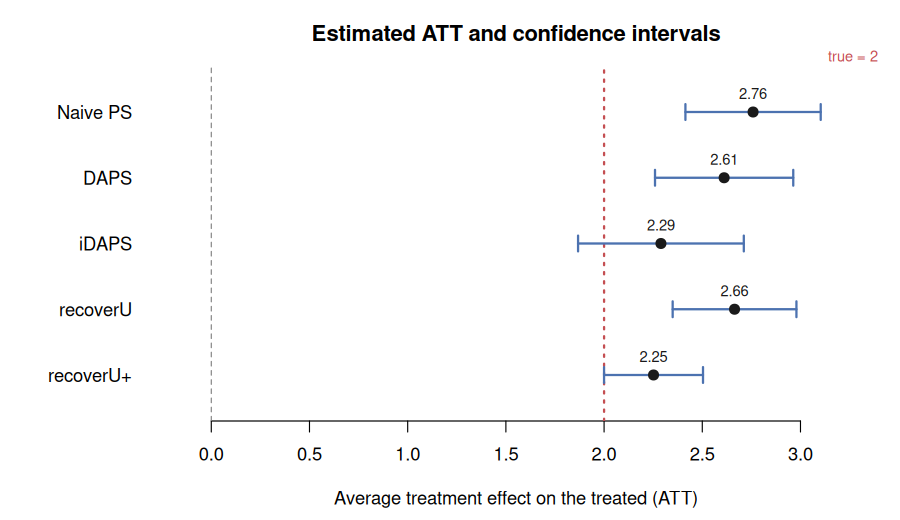

# spaci

<!-- badges: start -->
<!-- badges: end -->

**spaci — SPAtial Causal Inference under confounding and interference.**

`spaci` implements two unified methods for estimating the average treatment
effect on the treated (ATT) from spatial observational data when **spatial
confounding (SC)** and **spatial interference (SI)** occur together — a setting
where existing methods that address only one of the two are biased:

- **iDAPS** (`idaps()`) — *distance-adjusted propensity score with
  interference*. A matching estimator that matches treated to control units on a
  data-driven composite of three normalised distances,
  <code>D = &pi;&#8321;·D<sup>PS</sup> + &pi;&#8322;·D<sup>Spatial</sup> + &pi;&#8323;·D<sup>Interference</sup></code>.
  The weights are chosen by minimising a covariate/spatial/exposure balance
  score, not tuned by hand. Setting `π₃ = 0` recovers DAPS and `π₂ = π₃ = 0`
  recovers naive PS.
- **recoverU+** (`recoverUplus()`) — a **doubly robust** estimator whose
  propensity-score and control-outcome models are augmented with a *partially
  recovered spatial confounder* `U_R(s)` (recovered from the residual Matérn
  field by GLS) **and** a neighbourhood-exposure term, so that SC and SI are
  adjusted for simultaneously.

The naive PS (`naive_ps()`), DAPS (`daps()`) and recoverU (`recoverU()`)
comparators, a data simulator (`simulate_spatial_causal()`) and an all-methods
wrapper (`spatial_ate()`) are also provided.

This package accompanies the report *"Unified methods for causal effect
estimation: mitigating spatial confounding and interference concomitantly"*
(Ogunsola & Johnson).

## Installation

Install the released source directly from GitHub:

```r
# install.packages("remotes")
remotes::install_github("Ogunsolaia/iDAPS-and-recoverU-")
```

Or, equivalently, with **devtools**:

```r
# install.packages("devtools")
devtools::install_github("Ogunsolaia/iDAPS-and-recoverU-")
```

To build the vignettes locally as well, add `build_vignettes = TRUE`:

```r
remotes::install_github("Ogunsolaia/iDAPS-and-recoverU-",
                        build_vignettes = TRUE)
```

Then load it:

```r
library(spaci)
```

> If the repository is renamed to `spaci`, the install line becomes
> `remotes::install_github("Ogunsolaia/spaci")` (GitHub redirects the old URL,
> so the line above keeps working too).

### Requirements

- **R >= 4.1.0**; the package itself depends only on base R and `stats`, so
  there is nothing else to install for the core estimators.
- **Optional:** install `geoR` to reproduce the report's spatial-confounder fit
  exactly and pass `matern_method = "geoR"`. Without it, `spaci` uses a
  self-contained Matérn maximum-likelihood fit (`matern_method = "mle"`, the
  default). `ggplot2` and `readxl` are only needed to build the vignettes.

### Install from a local clone

If you have cloned the repository, install from its root:

```r
remotes::install_local("iDAPS-and-recoverU-")
# or, from within R with the working directory at the repo root:
# devtools::install()
```

## Worked example

```r
library(spaci)

## 1. Simulate data with BOTH spatial confounding and interference (true ATT = 2)
sim <- simulate_spatial_causal(n = 250, seed = 1)
##    sim$Y  outcome        sim$X       covariate matrix (X1, X2)
##    sim$Z  0/1 treatment  sim$coords  facility coordinates

## 2. Run every estimator at once (seed fixes the randomised matching order)
res <- spatial_ate(sim$Y, sim$Z, sim$X, sim$coords, tau = 0.1, seed = 1)
res
#>      Method   ATT   SE Lower Upper
#> 1  Naive PS  ...                      <- ignores SC and SI, most biased
#> 2      DAPS  ...
#> 3     iDAPS  ...                      <- adjusts for both
#> 4  recoverU  ...
#> 5 recoverU+  ...                      <- closest to the true ATT

## 3. Visualise the comparison (forest plot, Figure 2.5 style)
plot_ate(res, true_att = sim$true_att)

## 4. Inspect a single method
fit <- idaps(sim$Y, sim$Z, sim$X, sim$coords, tau = 0.1, seed = 1)
fit                     # ATT, CI and the selected (π₁, π₂, π₃) weights
fit$weights             # data-driven composite-distance weights
```

The forest plot places each method's ATT and confidence interval against the
"no effect" line (0) and the true effect:



### On your own data

Supply your outcome, binary treatment, covariates and coordinates directly. The
two recommended estimators:

```r
library(spaci)

# Y      numeric outcome            (length n)
# Z      binary treatment 0/1       (length n)
# X      covariates                 (n x p matrix or data frame)
# coords facility/site coordinates  (n x 2 matrix: longitude, latitude)

# iDAPS — matching on the composite distance
idaps(Y, Z, X, coords, tau = 0.1, caliper = 0.25, seed = 1)

# recoverU+ — doubly robust with recovered confounder + interference term
recoverUplus(Y, Z, X, coords, tau = 0.1)

# all five methods side by side, then plot
res <- spatial_ate(Y, Z, X, coords, tau = 0.1, seed = 1)
plot_ate(res)
```

`tau` sets the interference kernel bandwidth (smaller = more local); tune it to
the spatial scale of your interference.

## Inputs

All estimators share the same interface:

| Argument | Description |
|----------|-------------|
| `Y`      | numeric outcome vector |
| `Z`      | binary treatment/exposure vector (0/1) |
| `X`      | covariate matrix or data frame |
| `coords` | two-column matrix/data frame of spatial coordinates |
| `tau`    | spatial decay (bandwidth) of the exposure kernel |
| `caliper`| maximum matching distance (matching estimators) |

## Reproducing the simulation study

```r
methods <- c("Naive PS", "DAPS", "iDAPS", "recoverU", "recoverU+")
nsim <- 1000; true <- 2
store <- matrix(NA, nsim, length(methods), dimnames = list(NULL, methods))
for (s in seq_len(nsim)) {
  sim <- simulate_spatial_causal(n = 250, delta_u = 2.0, tau_exp = 0.1)
  store[s, ] <- spatial_ate(sim$Y, sim$Z, sim$X, sim$coords, seed = s)$ATT
}
data.frame(Method = methods,
           Bias = colMeans(store - true, na.rm = TRUE),
           MSE  = colMeans((store - true)^2, na.rm = TRUE))
```

## License

MIT © Isqeel Ogunsola, Olatunji Johnson
